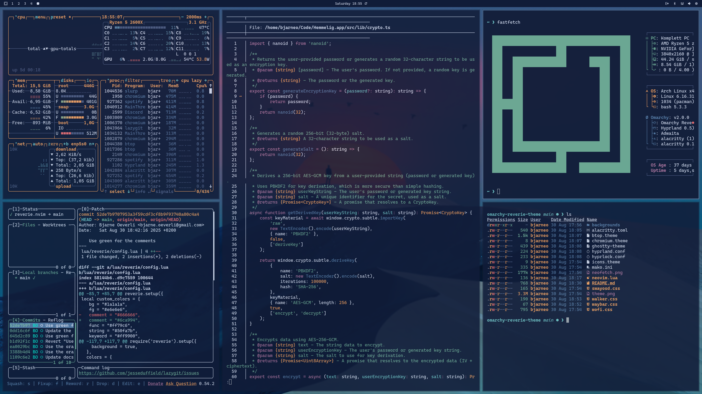
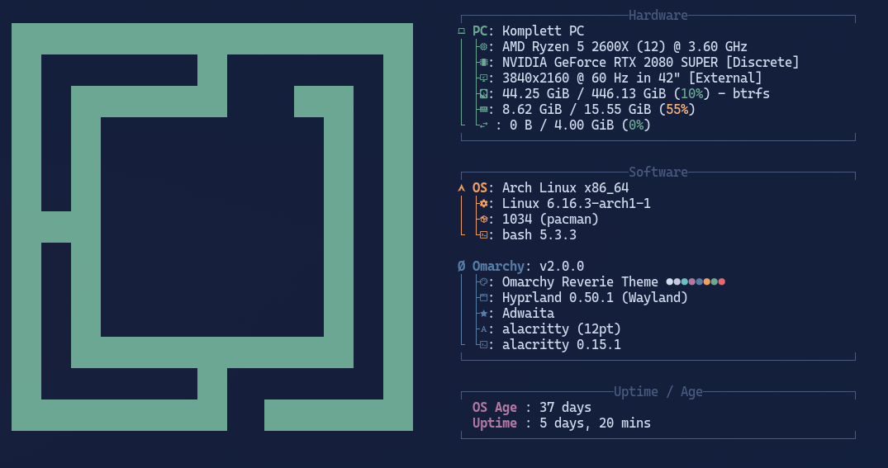

# Omarchy Reverie Theme

Reverie is a simple, elegant, and dark theme for Omarchy.org. It's designed for those moments of deep focus, when the world fades away and all that's left is you and your code.

> Where sky and shadow softly meet,  
> the world outside makes its retreat.  
> The mind, in silent reverie,  
> is calmed by light it came to see,  
> and finds itself completely free.  

<p align="center">
  
</p>

<p align="center">
  
</p>

## Installation

To install this theme, simply use the `omarchy-theme-install` command:

```bash
omarchy-theme-install https://github.com/bjarneo/omarchy-serenity-theme
```

## X.com
[iamdothash](https://x.com/iamdothash)
